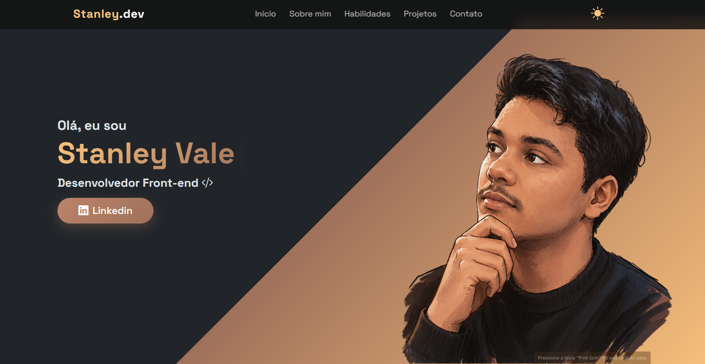

# Portfólio do Stanley Vale 💻

Bem-vindo ao **Portfólio do Stanley Vale**!

Um **site de portfólio** moderno, desenvolvido para apresentar meus projetos, habilidades e experiências como desenvolvedor front-end utilizando **HTML, CSS, JavaScript e Bootstrap**.

O projeto é totalmente **responsivo**, moderno e otimizado para computadores, tablets e dispositivos móveis.

---

## Demonstração ao Vivo 🚀

Você pode acessar o projeto online aqui:

[🌐 Acessar Portfólio](https://stanleyva71.github.io/meu-portfolio/)

---

## 🌟 Seções do Site

- **Home**: Apresentação pessoal com animações e introdução

- **Sobre Mim**: Informações sobre minha trajetória, tecnologias e objetivos

- **Habilidades**: Tecnologias e ferramentas que utilizo no desenvolvimento

- **Projetos**: Projetos desenvolvidos com descrição, preview e tecnologias utilizadas

- **Serviços**: Serviços oferecidos como desenvolvimento front-end e criação de interfaces modernas

- **Contato**: Formulário de contato funcional e links para redes sociais

- **Rodapé**: Navegação rápida e redes sociais

---

## ⚡ Recursos

- Tema escuro moderno
- Design elegante e minimalista
- Interface totalmente responsiva
- Navegação suave entre seções
- Efeitos hover e animações modernas
- Scroll indicator animado
- Cards interativos
- Formulário com validação
- Ícones e efeitos visuais modernos
- Organização visual profissional

---

## 🛠 Tecnologias Utilizadas

- **HTML5** – Estrutura semântica

- **CSS3** – Estilização moderna, responsividade e animações

- **JavaScript (Vanilla JS)** – Interatividade e funcionalidades

- **Bootstrap 5** – Layout responsivo e componentes

- **Bootstrap Icons** – Ícones modernos

- **AOS.js** – Animações durante o scroll

---

## 📄 Licença

Este projeto está licenciado sob a licença MIT. Consulte o arquivo [LICENSE](LICENSE) para mais informações.

---

## 🚀 Como executar o projeto

1. Clone o repositório:

```bash
git clone https://github.com/stanleyva71/meu-portfolio.git
```

2. Abra o projeto em seu editor de código

3. Execute o arquivo `index.html`

---

## 📬 Contato

- 📧 E-mail: stanleyva71@gmail.com
- 🌍 Localização: São Paulo, Brasil
- 💼 LinkedIn: www.linkedin.com/in/stanleyvale
- 🖥 GitHub: https://github.com/stanleyva71

---

Feito com ❤️ por **Stanley Vale**
